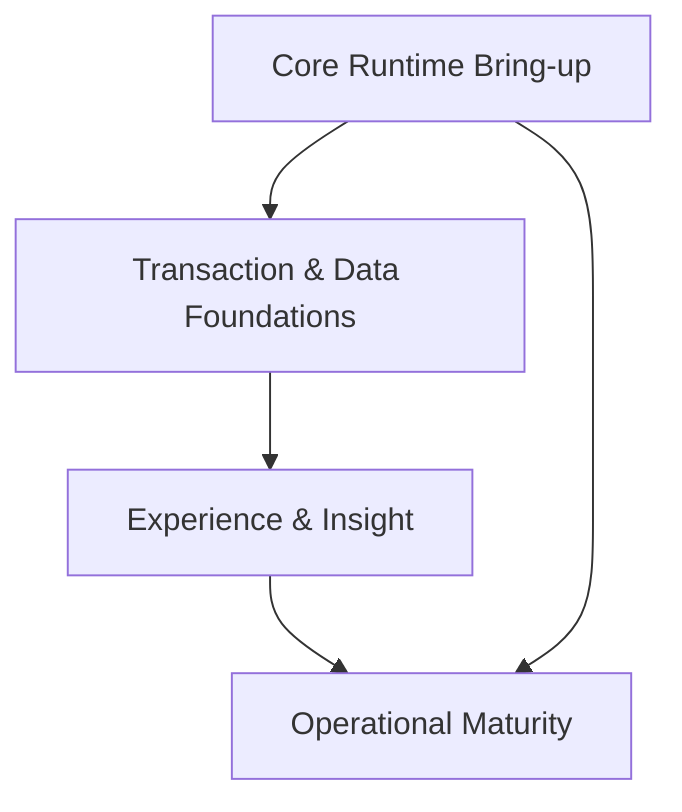

# Project Roadmap

> Updated: 2024-06-17

The roadmap aligns engineering, product, and operations so the platform launches with solid foundations and evolves toward a multi-tenant, AI-assisted creator marketplace.

## Documented Capability Milestones

| Status | Milestone | Documented Capabilities | Source |
| --- | --- | --- | --- |
| [Placeholder] | Architecture Shell → Replace placeholder commands with real runtimes. | Monorepo layout, TurboRepo structure, Docker Compose placeholders awaiting Django/Next.js apps. | [Architecture](./index.md)
| [Placeholder] | Documented Auth Flows → Implement JWT + OAuth endpoints. | Email/password & OAuth login, refresh/logout, secure cookies, audit logging, security testing suite. | [Auth & Security](./auth-security.md)
| [Placeholder] | Backend Blueprint → Scaffold Django project and domain apps. | Planned Django + Ninja stack, app responsibilities (auth, wallet, tickets, payments, reports, notifications), enable migrations & Gunicorn. | [Backend](./backend.md)
| [Placeholder] | Frontend Blueprint → Scaffold Next.js App Router experience. | Next.js + HeroUI stack, planned routes (`/dashboard`, `/wallet`, `/tickets`, `/admin`), Zustand state, build commands. | [Frontend](./frontend.md)
| [Placeholder] | Database Schema → Materialize core tables and constraints. | Users, wallets, ledger entries, tickets, payments, reports, notifications tables with indexes and RLS guidance. | [Database Schema](./database-schema.md)
| [Placeholder] | API Surface → Ship Ninja routers matching documented contracts. | Auth, users, wallet, ticket, report endpoints with example payloads and error handling. | [API Reference](./api-reference.md)
| [Placeholder] | Reporting Stack → Build dashboards & exports pipeline. | Role-based dashboards, Redis caching, aggregation jobs, CSV/PDF exports, performance considerations. | [Dashboards & Reporting](./dashboards-reporting.md)
| [Placeholder] | Payment Rails → Integrate Zarinpal adapter with ledger sync. | Zarinpal endpoints, initiation/verification flows, sandbox creds, error codes, reconciliation steps, HMAC signatures. | [Payment Integration](./payment-integration.md)
| [Placeholder] | Messaging Fabric → Stand up Celery-powered notifications. | Multi-channel templates (SMS, WhatsApp, Email), retry logic, logging, admin broadcast tools, Prometheus metrics. | [Notifications & Messaging](./notifications-messaging.md)
| [Placeholder] | Role Enforcement → Enforce RBAC end-to-end. | Admin/User roles, permission matrix, decorators, dashboard access rules, future roles. | [User Roles & Permissions](./user-roles-permissions.md)
| [Placeholder] | Quality Gates → Automate testing strategy. | PyTest, Django Test Client, Jest/RTL, Playwright, Locust, Bandit/Safety workflows, fixtures and coverage guidance. | [Testing Guide](./testing.md)
| [Placeholder] | Operational Platform → Turn DevOps scaffolding into CI/CD. | GitHub Actions blueprints, Docker images, environment secrets, monitoring stack, Terraform/Ansible roadmap. | [DevOps & Deployment](./devops-deployment.md)
| [Placeholder] | Platform Cohesion → Align services with system design guardrails. | Cross-service flows (auth, wallets, tickets), integration topology, scalability tactics, security principles. | [System Design](./system-design.md)

## Phase 1 — Core Runtime Bring-up

| Status | Focus | Based On | Next Step |
| --- | --- | --- | --- |
| [Placeholder] | Activate Architecture Shell | Architecture, Backend, Frontend | Generate Django + Next.js projects and switch Compose/Dockerfile commands to real runtimes. |
| [Placeholder] | Stand up Auth & RBAC | Auth & Security, User Roles & Permissions | Build `/auth/login`, `/auth/refresh`, role-aware middlewares, and audit logging. |
| [Placeholder] | Materialize Database Schema | Database Schema | Create migrations for users, wallets, tickets, payments, notifications with documented indexes. |

## Phase 2 — Transaction & Data Foundations

| Status | Focus | Based On | Next Step |
| --- | --- | --- | --- |
| [Placeholder] | Deliver API Surface | API Reference, System Design | Implement Ninja routers for users, wallet, tickets, reports and align responses to documented contracts. |
| [Placeholder] | Wire Payment Rails | Payment Integration, Database Schema | Build Zarinpal initiation/verification, ledger reconciliation, and failure handling. |
| [Placeholder] | Enable Messaging Fabric | Notifications & Messaging, System Design | Launch Celery worker, channel adapters, and notification templates with retries. |

## Phase 3 — Experience & Insight

| Status | Focus | Based On | Next Step |
| --- | --- | --- | --- |
| [Placeholder] | Launch Frontend Experience | Frontend, API Reference | Implement documented routes, state management, and API client wrappers to render live data. |
| [Placeholder] | Build Reporting Stack | Dashboards & Reporting, Database Schema | Implement aggregation jobs, Redis caching, and export endpoints powering dashboards. |
| [Placeholder] | Establish Quality Gates | Testing Guide, DevOps & Deployment | Enable automated lint/test pipelines, Playwright suite, and CI enforcement. |

## Phase 4 — Operational Maturity

| Status | Focus | Based On | Next Step |
| --- | --- | --- | --- |
| [Placeholder] | Harden Operations | DevOps & Deployment | Turn placeholder GitHub Actions into deploy pipelines, configure monitoring stack, and document rollback drills. |
| [Placeholder] | Scale & Secure Platform | System Design, Auth & Security | Apply scalability patterns, enforce encryption practices, and finalize incident response workflows. |
| [Placeholder] | Close Reporting Feedback Loop | Dashboards & Reporting, Testing Guide | Add observability metrics, regression alerts, and usage analytics to refine product decisions. |

## Dependency Map

## Decision Log

- Keep Docker Compose placeholder commands until each milestone flips from [Placeholder] to [In Progress]; change commands only when code compiles locally.
- Promote docs as the source of truth—new work must update both implementation and corresponding documentation row before marking a milestone [In Progress].
- Treat GitHub Actions workflows as opt-in: uncomment real steps only after the related capability passes local verification.

## Risks & Mitigations

| Risk | Mitigation |
| --- | --- |
| Capability remains stuck in [Placeholder] because upstream docs drift. | Pair each implementation PR with documentation validation to keep milestones accurate. |
| Rushing payment integration without ledger support breaks accounting. | Complete "Wire Payment Rails" only after "Materialize Database Schema" covers ledger entries and constraints. |
| CI/CD activation before tests exist causes noisy failures. | Follow the phased rollout—"Establish Quality Gates" happens after backend/frontend/tests are committed. |

## Success Metrics

- 99.5% uptime across staging/prod once launch occurs.
- <15 min mean time to restore (MTTR) after incident.
- Monthly feature adoption growth >20% for community capabilities.
- Deployment frequency ≥2 per week by end of Phase 4.

Stay agile: revisit this roadmap at every phase checkpoint to sync with product feedback and market shifts.
