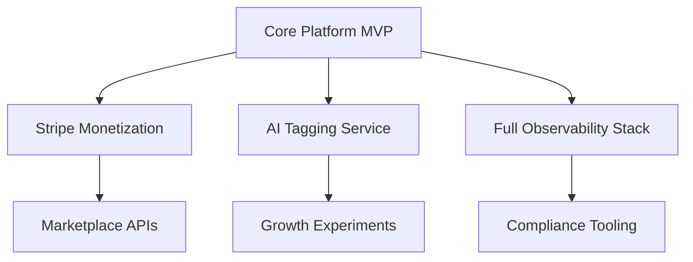

# Project Roadmap

> Updated: 2024-06-17

The roadmap aligns engineering, product, and operations so the platform launches with solid foundations and evolves toward a multi-tenant, AI-assisted creator marketplace.

## 2024 Q3 — Foundation Launch

| Track | Objectives | Key Deliverables |
| --- | --- | --- |
| Platform Core | Ship v1 authentication, onboarding, and baseline dashboards. | Django backend auth flows, Next.js landing + dashboard, PostgreSQL schema migration set |
| Content Pipeline | Enable asset uploads with processing queue. | S3-compatible storage integration, Celery worker image (placeholder commands in compose kept commented until Celery app lands), upload moderation workflow draft |
| DevOps | Keep parity between dev/staging/prod. | GitHub Actions PR/release flows, Dockerized services, nightly health workflow |
| Observability | Light telemetry to catch regressions early. | Sentry wiring, Prometheus + Grafana stack (dashboards stubbed) |

## 2024 Q4 — Monetization & Automation

1. Subscription engine with Stripe billing cycles and usage-based add-ons.
2. AI tagging service (FastAPI microservice) to accelerate asset discovery.
3. Infrastructure-as-Code promotion: Terraform modules for DO Kubernetes, Ansible hardening playbooks.
4. Incident response runbooks + pager rotations documented in `docs/ops/` (folder to be created when content is ready).

## 2025 Q1 — Scale & Community

- Roll out community features (comments, follows) with rate limiting and spam tooling.
- Launch analytics warehouse: dbt transformations feeding Metabase dashboards.
- Formalize blue/green deployments with canary releases via Argo Rollouts.

## 2025 Q2 and Beyond — Ecosystem Expansion

| Initiative | Description |
| --- | --- |
| Marketplace APIs | Partner integration APIs with OAuth scopes, sandbox credentials, and throttling policies. |
| Multi-Tenancy | Namespace isolation for enterprise tenants, billing upgrades, per-tenant feature flags. |
| Compliance | SOC 2 Type I readiness checklist, automated evidence collection via Drata integration. |
| Growth Experiments | Personalized recommendations using retrained embeddings every sprint. |

## Dependency Map

## Decision Log

- Maintain Docker Compose stubs with placeholder commands until respective apps land to avoid broken CI.
- Keep GitHub Actions workflows in dry-run mode where real services are missing; swap comments once services ship.
- Prioritize Terraform remote state before provisioning new environments to protect drift-sensitive infra changes.

## Risks & Mitigations

| Risk | Mitigation |
| --- | --- |
| Late backend delivery stalls AI tagging integration. | Track backend API readiness in sprint reviews; AI team uses mocked endpoints until stable. |
| GHCR image sprawl increases costs. | Automate retention policy (workflow ticket `DEVOPS-42`). |
| Terraform rollout blocked by missing secrets. | Store secrets in GitHub OIDC + Vault bridging, document in `docs/devops-deployment.md`. |

## Success Metrics

- 99.5% uptime across staging/prod once launch occurs.
- <15 min mean time to restore (MTTR) after incident.
- Monthly feature adoption growth >20% for community capabilities.
- Deployment frequency ≥2 per week by end of 2024 Q4.

Stay agile: revisit this roadmap at every quarterly planning to sync with product feedback and market shifts.
